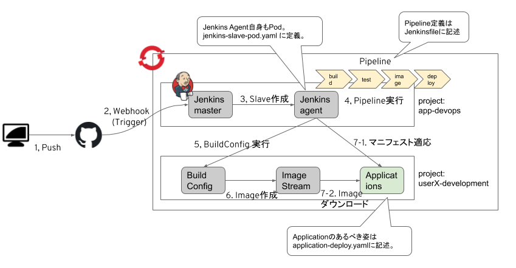

# 20200626ワークショップ
## 概要


## 事前準備
### Jenkinsの構築 (管理者向け)
ワークショップ管理者向けのJenkins構築設定.
また、利用者分のPodで利用するPVCの事前作成が必要。

```
$ oc new-project app-devops
$ git clone https://github.com/mosuke5/openshift-custom-jenkins
$ cd openshift-custom-jenkins

$ oc apply -f example-manifest.yaml
buildconfig.build.openshift.io/custom-jenkins created
imagestream.image.openshift.io/custom-jenkins created
buildconfig.build.openshift.io/custom-jenkins-agent created
imagestream.image.openshift.io/custom-jenkins-agent created

$ oc start-build custom-jenkins
build.build.openshift.io/custom-jenkins-1 started

$ oc process --param JENKINS_IMAGE_STREAM_TAG=custom-jenkins:latest --param NAMESPACE=app-devops --param ENABLE_OAUTH=true --param MEMORY_LIMIT=4Gi --param CPU_LIMIT=2000m --param VOLUME_CAPACITY=10Gi --param DISABLE_ADMINISTRATIVE_MONITORS=true -f template.yaml | oc apply -f -

$ oc start-build custom-jenkins-agent
build.build.openshift.io/custom-jenkins-agent-1 started

$ oc get route jenkins -o jsonpath='{.spec.host}'
jenkins-app-devops.apps.cluster-3c0e.3c0e.sandbox951.opentlc.com

$ oc policy add-role-to-user edit user1 -n app-devops
$ oc policy add-role-to-user edit user2 -n app-devops
$ oc policy add-role-to-user edit user3 -n app-devops
$ oc policy add-role-to-user edit user4 -n app-devops
$ oc policy add-role-to-user edit user5 -n app-devops
```

### OpenShiftプロジェクトの作成
`userX`の`X`は利用しているユーザの番号に変更してください。
`oc policy xxx`コマンドでは、Jenkinsが他のProjectに対してPod作成などのデプロイ作業を行うため、Jenkins Service Accountに対して権限の付与をする必要があります。

```
$ oc new-project userX-development
$ oc policy add-role-to-user edit system:serviceaccount:app-devops:jenkins -n userX-development
```

### レポジトリのフォーク
Githubでこのレポジトリをフォークし、自分のアカウントにレポジトリをコピーしましょう。

また1箇所変更が必要です。Jenkinsfileの3行目を自分のプロジェクト名に変更しましょう。

```
$ vim Jenkinsfile
def deploy_project = "userX-development"
```

## Jenkinsへのアクセス
- URL: https://jenkins-app-devops.apps.cluster-6a92.6a92.sandbox595.opentlc.com/
- ID/PW: OpenShiftのアカウントです

## Jenkins Job作成
アプリケーションのパイプラインを実行するためにJenkins Itemを作成する。

1. "New Item"を選択
1. Itemの種類は"Pipeline"を選択し、`userX-job`の名前をつける。わかりやすいようにユーザ名を先頭に付けてください。
1. "Build Triggers"項目で"Generic Webhook Trigger"にチェックを付け下記を設定する
    - token: 任意の文字列(他の人とかぶらないようにユーザ名を含めてください。)
1. "Pipeline"の項目で実行するパイプライン定義を設定する
    - "pipeline script from SCM"を選択
    - SCMに"Git"を選択
    - Repository URLにはフォークした自分のレポジトリのURLを入力
    - Branches to buildは`*/master`を入力
    - これでSave

## GitレポジトリへWebhook設定
お使いのGitレポジトリへWebhookの設定を行う。
Generic Webhook Triggerの場合下記のURLでトリガーできる。

```
https://jenkins-app-devops.apps.cluster-6a92.6a92.sandbox595.opentlc.com/generic-webhook-trigger/invoke?token=<your-token>
```

## パイプライン実行
ここまでできたらパイプラインを実行すれば、アプリケーションがデプロイされる。
アプリケーションの変更にも自動でデプロイできる状態だ。
レポジトリに任意の変更を加えてみよう。


## 動作確認
パイプラインが正常に終了すれば、みなさんのProject内にPodが起動していることを確認しよう。  
初回は、データベースがないため、アプリケーションの起動に一度失敗するが、データベースが起動後にアプリケーションが自動的に起動するはずです。

```
$ oc get pod -n userX-development
NAME                              READY   STATUS      RESTARTS   AGE
pipeline-practice-java-1-build    0/1     Completed   0          53m
pipeline-practice-java-1-deploy   0/1     Completed   0          50m
pipeline-practice-java-1-9cgtf    1/1     Running     0          50m
postgresql-1-deploy               0/1     Completed   0          50m
postgresql-1-hook-post            0/1     Completed   0          50m
postgresql-1-kk5nv                1/1     Running     0          50m
```


最後は起動したアプリケーションにブラウザから接続して確認してみよう。
URLは`https://xxxxxxxxxxxx/hello` or `https://xxxxxxxxxxxx/freelancers`

URLは下記から確認できる。
```
$ oc get route
```

## なにが起きているのか解説
ここまでできたところで、一度なにが行われたのか解説します。

- Jenkinsfile
  - test
  - application build
  - image build
  - deploy
- Kubernetes manifests
- Jenkins agent

## パイプラインの速度の改善
パイプライン環境はPodで動作するため、実行の都度クリーンな環境から実行されます。クリーンな環境でテストやビルドを実行できることは、コンテナのメリットであり望ましい状態ではありますが、一方でアプリケーションの依存パッケージのダウンロードも毎回行われることで速度が落ちるなどデメリットも多いです。
試しに、Jenkinsの画面から手動でビルドを実行して、アプリケーションの依存パッケージの再ダウンロードが行われていることを確認してみましょう。

これらの問題にアプローチするために、いくつかの方法がありますが、アプリケーションの依存パッケージを保存するディレクトリを永続ボリュームにすることで対応することができます。

```yaml
# jenkins-slave-pod.yaml にvolumeを追加してみよう
apiVersion: v1
kind: Pod
spec:
  serviceAccountName: jenkins
  volumes:
    - name: m2-volume
      persistentVolumeClaim:
        claimName: userX-jenkins-agent-m2
  containers:
    - name: jnlp
      image: image-registry.openshift-image-registry.svc:5000/app-devops/custom-jenkins-agent-maven
      args: ['$(JENKINS_SECRET)', '$(JENKINS_NAME)']
      volumeMounts:
        - mountPath: "/home/jenkins/.m2"
          name: m2-volume
    ...
```

## アプリケーションに変更を加える
### テストを落としてみる
現状のサンプルアプリケーションでは`/hello`は`"hello": "world"`を含むAPIを返すことがテストとして書かれています。
`src/main/java/com/redhat/freelancer4j/freelancer/rest/HealthCheckEndpoint.java`の34行目の `map.put("hello", "world");` を任意の文字列に変更してパイプラインを実行させてみよう。
パイプラインの結果がどうなったか確認してみましょう。

```java
    @GET
    @Path("/hello")
    @Produces(MediaType.APPLICATION_JSON)
    public Map<String, String> getHello() {
        HashMap<String, String> map = new HashMap<>();
        map.put("hello", "world!!!!!");
        map.put("foo", "bar");
        return map;
    }
```

### テストを変更してデプロイする
上で落ちてしまったパイプラインを修正するため、`src/test/java/com/redhat/freelancer4j/freelancer/rest/HealtCheckEndpointTest.java`のテストを変更して変更をデプロイしてみます。デプロイが成功後に`/hello`に接続し、意図したようにアプリケーションが変更されていることを確認しましょう。

```java
    @Test
    public void invokeHello() throws Exception {
        given().get("/hello").then().assertThat().statusCode(200).body("hello", equalTo("world!!!!!"));
    }
```

## 静的解析
`Jenkinsfile`内でコメントアウトされている静的解析の処理(`mvn spotbugs:check`)を有効化してみよう。  
おそらく、静的解析の結果エラーとなりパイプラインが落ちるはずです。静的解析の結果がどのようなものか確認してみましょう。  
最後に、この場ではエラーを修正できませんのでコメントアウトして元にもどしておきましょう。

```
        stage('Code analysis') {
          steps {
            echo "Exec static analysis"
            sh 'mvn spotbugs:check'
          }
        }
```

```
// 出力例
[INFO] BugInstance size is 5
[INFO] Error size is 0
[INFO] Total bugs: 5
...
```

## コンテナイメージを確認
何度かパイプラインを動かしてみたところで、コンテナイメージを確認してみよう。  
OpenShiftのコンソール画面から、`Builds -> Image Streams` をクリックし今まで作成されたコンテナイメージを確認し、タグ名がどうなっているのかぜひ確認してみましょう。

## パイプラインに処理を追加する
最後に、実際にパイプラインの処理を追加してみましょう。  
上までの前提では何が問題でしょうか？  
デプロイしただけでそれがうまく機能しているかどうかは確認できていません。
簡易なShellを使って機能の正常性を確認するパイプラインを追加してみましょう。

```groovy
//TODO
script {
  openshift.withCluster() {
    openshift.withProject("${deploy_project}") {
      def dc = openshift.selector("route", "${app_name}").object()
      def url = dc.spec.host
      echo "${url}"
      while (true) {
        def app_status = sh(returnStdout: true, script: "curl ${url}/hello -o /dev/null -w '%{http_code}' -s").trim()
        if(app_status == "200") {
          break;
        }
        sleep 5
      }
    }
  }
}
```

## オプション
早く終わったひとは、ぜひ下記に挑戦してみましょう。

- パイプランに任意のステージを追加し拡張してみましょう
- Jenkins Pipeline内で負荷テストを実行してみよう
  - apache bench
  - カスタムJenkins Agentの作成

## パイプラインの分割
今までの例では、アプリケーションのソースコードレポジトリの中にOpenShiftへのデプロイするためのマニフェストファイルを管理してきました。アプリケーションのビルドパイプラインの延長でデプロイも行ってきましたが、以下のような問題が発生しえます。

- マニフェストの単純な変更でもCIパイプライン全体が実行される。
- マニフェスト（OpenShift）への変更履歴を管理できない（しずらい）。
- マイクロサービスで複数のサービスを管理する場合、異なるバージョンの組み合わせでのリリースが難しい。
- 開発者の意図しないマニフェストへの変更がデプロイされる。

これらの問題に対応するには、アプリケーションのソースコードレポジトリとマニフェストのレポジトリを分離するというアプローチがある。

マニフェストを分離したレポジトリは下記である。  
また、本日はArgo CDを用いたデプロイについて挑戦する。

https://github.com/mosuke5/openshift-pipeline-practice-java-manifest